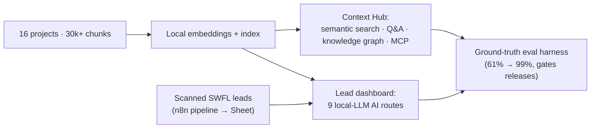

# SFX Lead Intelligence Command Center

> A local-LLM command center: a semantic hub over 16 of my projects (30,000+ chunks) with a knowledge graph and an MCP server, plus a lead-intelligence dashboard with 9 AI routes. Runs entirely on my own GPU. No cloud.

> **In plain terms:** This is a private AI setup that runs on my own computer instead of a paid cloud service, so my data stays with me. One half helps me search everything I have built, and the other half helps me study and reach out to new business leads.

%20%C2%B7%20RAG%20%C2%B7%20MCP-7a5cff)

**Source is private by design**: public showcase only.

<!-- drop a screenshot of the knowledge graph or dashboard here: assets/hero.png -->

---

## What it is

> **In plain terms:** One tool with two jobs. It lets me, or an AI helper working for me, search across all of my past work by meaning, and it gives my sales work a single screen for researching and contacting leads.

Two halves of one local-LLM (AI models that run on my own hardware, not a cloud service) workbench I built to run my own company on:

**1. Context Hub**: a semantic index (a search that matches by meaning, not just exact keywords) over **16 of my projects (30,000+ chunks)** with a force-directed **knowledge graph** (an interactive map of how those projects and topics connect) and an **MCP server** (a standard way for outside AI tools to plug into this data), so any AI agent (or I) can search, ask questions across, and reason over my entire body of work. Fully local embeddings (numeric fingerprints of text that let a computer compare meaning); nothing leaves the machine.

**2. Lead Intelligence Dashboard** (one screen that brings the lead information together): a command-center UI over scanned Southwest-Florida business leads (fed by an upstream n8n pipeline), with **9 local-LLM AI routes** spanning research, outreach drafting, and sales preparation.

## The part I'm proudest of: a ground-truth eval harness

> **In plain terms:** It is easy to get an AI to say something. It is hard to know whether the answer is actually correct. I built an automatic grader that checks the system's answers against known-good ones, which is how quality went from 61% correct to 99% correct.

Anyone can make an LLM answer. The hard problem is knowing whether the answer is *right*, at scale, without reading every one by hand. I built a **ground-truth evaluation harness** that grades the system's answers across 20+ query types, which **lifted chat quality from 61% to 99%** and catches regressions before they ship.

## How it's built

> **In plain terms:** The diagram below shows how the parts fit together, from my projects and leads on the left, through the local AI, to the automatic grader on the right that checks quality before anything ships.

## Tech

> **In plain terms:** The main building blocks. Everything in the Local LLM row runs offline on my own graphics card, so nothing is sent to an outside company.

| Layer | Stack |
|---|---|
| App | Next.js 15 (App Router, TypeScript) |
| Local LLM | Ollama (qwen3) + nomic-embed, on-GPU, offline |
| Retrieval | Semantic index (RAG, meaning the AI looks up my own documents before it answers) + force-directed knowledge graph |
| Interop | Model Context Protocol (MCP) server |
| Upstream | n8n lead-generation pipeline → Google Sheets |
| Quality | Custom ground-truth evaluation harness (20+ query types) |

## Status
In production (internal), it's the system I use daily to search my projects and run SFX Tech's lead intelligence.

---

Built by **Jesse Jolly** · [SFX Tech Innovation](https://sfxtechinnovation.com) · [LinkedIn](https://linkedin.com/in/jessegjolly)

*Source code is private and proprietary. This repository showcases the product and its architecture only.*
